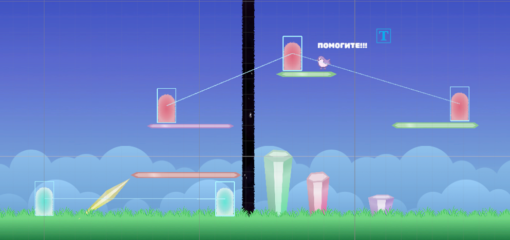

# fly-cat

2D платформер, разработанный на Unity. Игроку потребуется смекалка для прохождения различных головоломок,  которые меняют пространство.

## О проекте

Цель проекта - разработать программную подсистему, обеспечивающую нелинейное прохождение уровней двумерного платформера с механикой свертки пространства за счет двух взаимосвязанных механик.

## Геймплей

- Пример механики разлома

- Пример механики порталов

## Примеры

- Третий уровень из демо версии игры

## Будущее

- Сохранение прогресса в демо версии
- Разработка новых обьектов для взаимодействия
- Улучшить редактор Unity для упрощенного лвл-дизайна
- Улучшение взаимодействия игрока с миром

## Программа

- Unity 6
- URP 17.4.0 с 2D Renderer

## Скачать-

Можно скачать демо версию игры [**по ссылке**](https://github.com/marmeladka-23/fly-cat/releases/tag/v1.0).
